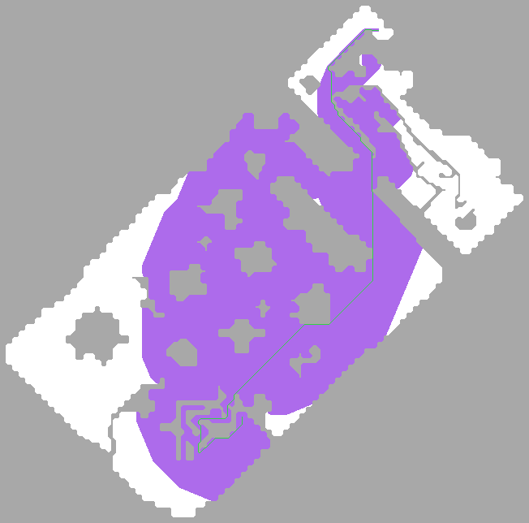
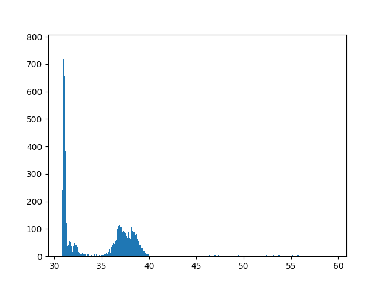
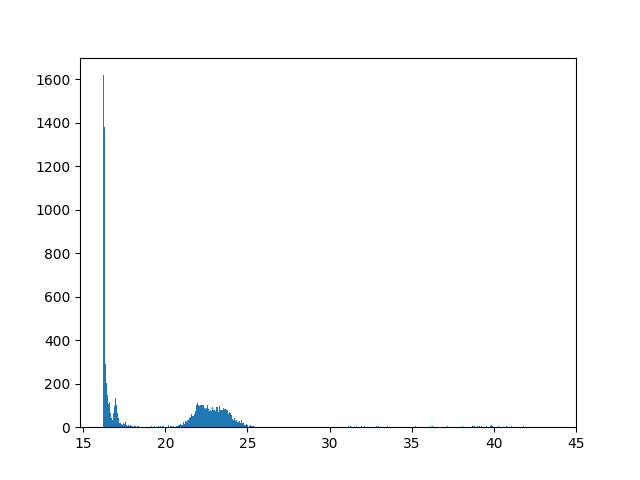
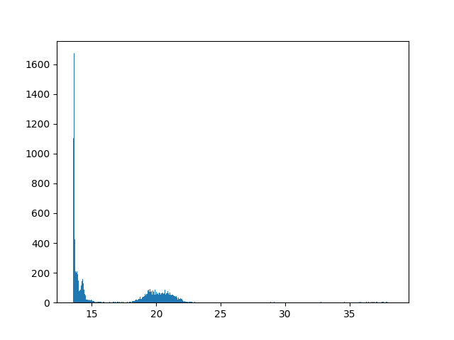
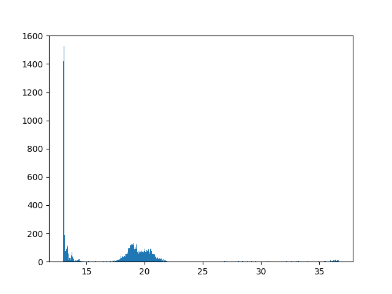
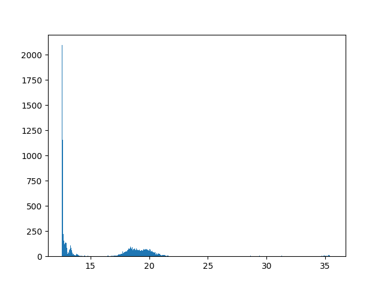
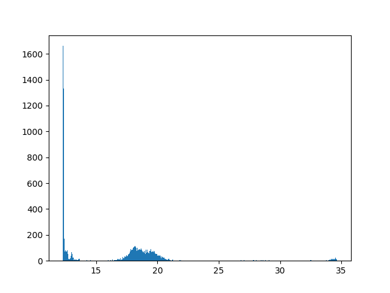
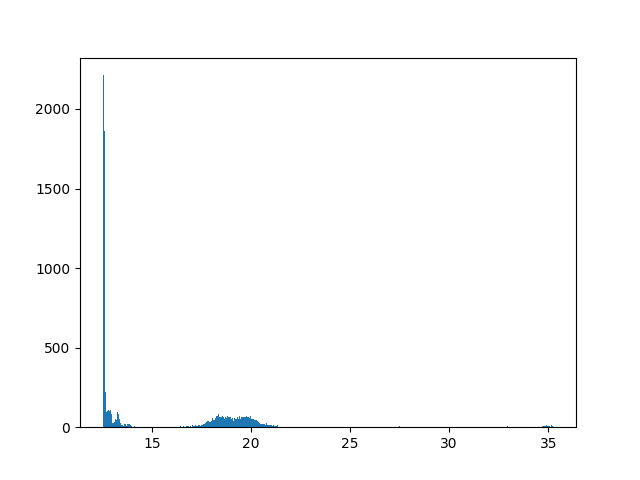
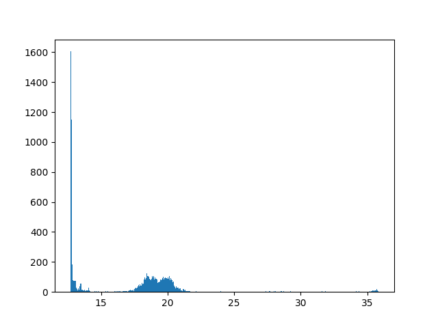

# Data structures

## Movement Paths

Path are represented as a contigious sequence of PathEntries (PE):

| PE 0  | PE 1  | PE 2  | PE 3  | PE 4  | ...  |
| ----- | ----- | ----- | ----- | ----- | ---- |

Where each PE is a bitset of 3 bits (rqp):

| bit 2 | bit 1 | bit 0 |
| ----- | ----- | ----- |
| r     | q     | p     |


PEs are then packed into sequence of bytes, with right-to-left bit order, with possibility of PEs traversing boundaries of single byte
(i.e. tigthly packed):

```
| byte 0                      | byte 1                        | byte 2
|  7  6  5    4  3  2    1  0 |  7    6  5  4    3  2  1    0 |  7  6   ...
| r0 q0 p0 : r1 q1 p1 : r2 q2 | p2 : r3 q3 p3 : r4 q4 p4 : r5 | q5 p5 : ...
```

TODO: REWRITE TABLES

There are 8 possible movements, excluding (0, 0):
`(-1, -1), (-1, 0), (-1, 1), (0, -1), (0, 0), (0, 1), (1, -1), (1, 0), (1, 1)`
Each next movement cell is encoded using a 3x3 table:

```
|---------|---------|---------|
| r = .   | r = .   | r = .   |
| q = .   | q = .   | q = .   |
| p = .   | p = .   | p = .   |
|---------+---------+---------|
| r = .   | current | r = .   |
| q = .   | player  | q = .   |
| p = .   | cell    | p = .   |
|---------+---------+---------|
| r = .   | r = .   | r = .   |
| q = .   | q = .   | q = .   |
| p = .   | p = .   | p = .   |
|---------|---------|---------|
```

Which gives the following movements translation (coordinates start as usual, in top left corner):

```
|---------|---------|---------|
| PE = .  | PE = .  | PE = .  |
| dX = -1 | dX =  0 | dX =  1 |
| dY = -1 | dY = -1 | dY = -1 |
|---------+---------+---------|
| PE = .  | current | PE = .  |
| dX = -1 | player  | dX =  1 |
| dY =  0 | cell    | dY =  0 |
|---------+---------+---------|
| PE = .  | PE = .  | PE = .  |
| dX = -1 | dX =  0 | dX =  1 |
| dY =  1 | dY =  1 | dY =  1 |
|---------|---------|---------|
```


## Distance finding

* Use octile distance metric
* Use A* algorithm


### Heap Queue performance details
In A* algorithm we use a heap queue. Different implementations were timed
and below are their performance results for 652 x 644 map:

Map: [pthtest_4x.png](/tests/maps/pthtest_4x.png)  
Map size: 652 x 644 pixels  
Coordinates: from `(298, 512)` to  `(466,  37)`  


Timing repeated 10k times with random 10..1010 ms invocation interval.


| HeapQ                          | avg, ms | min, ms | max, ms | std dev, ms | historgam                                  |
| ------------------------------ | ------- | ------- | ------- | ----------- | ------------------------------------------ |
| Fibonacci heap                 | 35.09   | 30.78   | 59.43   | ± 4.61      |    |
| D-Ary, arity = 2 (binary heap) | 20.25   | 16.17   | 43.63   | ± 4.68      |  |
| D-Ary, arity = 3               | 17.09   | 13.52   | 38.32   | ± 4.44      |  |
| D-Ary, arity = 4               | 17.46   | 12.98   | 36.68   | ± 4.63      |  |
| D-Ary, arity = 5               | 16.31   | 12.54   | 35.58   | ± 4.42      |  |
| D-Ary, arity = 6               | 16.71   | 12.26   | 34.67   | ± 4.63      |  |
| D-Ary, arity = 7               | 15.90   | 12.50   | 35.26   | ± 4.37      |  |
| D-Ary, arity = 8               | 17.26   | 12.69   | 35.86   | ± 4.46      |  |